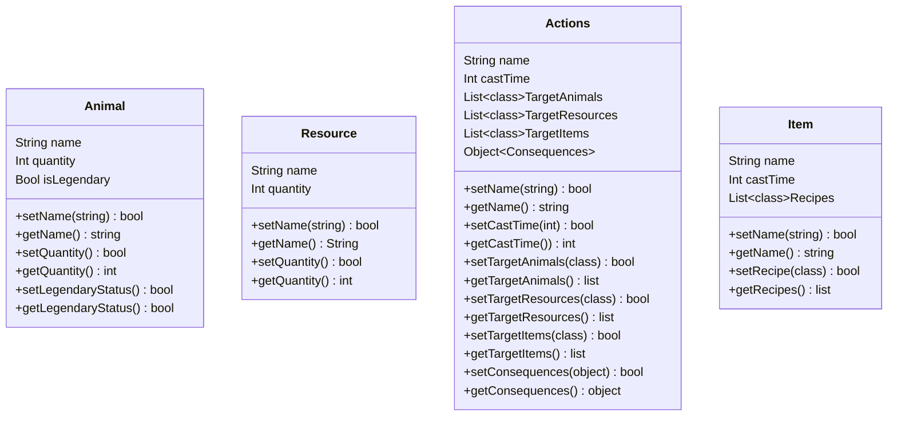

# Exothium-World-JavaScript-Test
Testing mechanics for balancing 

```mermaid
classDiagram
class Animal{
  String name
  Int quantity
  Bool isLegendary
  +setName(string) bool
  +getName() string
  +setQuantity() bool
  +getQuantity() int
  +setLegendaryStatus() bool
  +getLegendaryStatus() bool
}

class Resource{
  String name
  Int quantity
  +setName(string) bool
  +getName() String
  +setQuantity() bool
  +getQuantity() int
}

class Actions{
  String name
  Int castTime
  List~class~TargetAnimals
  List~class~TargetResources
  List~class~TargetItems
  Object~Consequences~
  +setName(string) bool
  +getName() string
  +setCastTime(int) bool
  +getCastTime()) int
  +setTargetAnimals(class) bool
  +getTargetAnimals() list
  +setTargetResources(class) bool
  +getTargetResources() list
  +setTargetItems(class) bool
  +getTargetItems() list
  +setConsequences(object) bool
  +getConsequences() object
}


class Item{
  String name
  Int castTime
  List~class~Recipes
  +setName(string) bool
  +getName() string
  +setRecipe(class) bool
  +getRecipes() list
}
```

    
  
            

